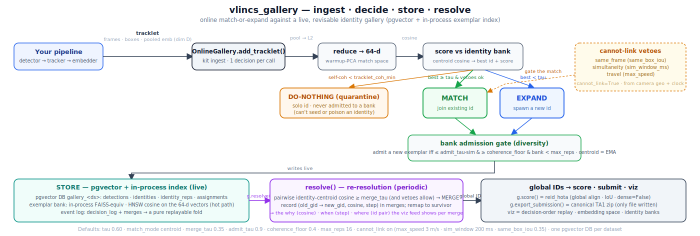

# vlincs_gallery

[](SCORES.md) [](SCORES.md)

> Best online IDF1 per dataset (canonical `reid_hota`), with the commit that achieved it. Full per-dataset history — score, author, date, commit — in [`SCORES.md`](SCORES.md), refreshed on every commit by the self-hosted maxwell runner.

<!-- CI-SCORES:START -->
**Best IDF1:** **MS02** 0.754 @ `9f134b6` · **DS1** 0.624 @ `9f134b6`

**Per-video — latest run @ `9f134b6`** (global-aligned, worst first — where we fail):

_MS02_

| Video | IDF1 | AssA | DetRe |
|---|---|---|---|
| MCAM310 | 0.445 | 0.438 | 0.333 |
| MCAM318 | 0.887 | 0.933 | 0.866 |

_DS1_

| Video | IDF1 | AssA | DetRe |
|---|---|---|---|
| vlincs_MS01_MC0001_MCAM05_2024-03-Tc6 | 0.331 | 0.530 | 0.527 |
| vlincs_MS01_MC0001_MCAM06_2024-03-Tc6 | 0.523 | 0.577 | 0.393 |
| vlincs_MS01_MC0001_MCAM04_2024-03-Tc6 | 0.552 | 0.476 | 0.457 |
| vlincs_MS01_MC0001_MCAM06_2024-03-Tc8 | 0.578 | 0.565 | 0.502 |
| vlincs_MS01_MC0001_MCAM03_2024-03-Tc8 | 0.580 | 0.519 | 0.472 |
| vlincs_MS01_MC0001_MCAM03_2024-03-Tc6 | 0.670 | 0.603 | 0.572 |
| vlincs_MS01_MC0001_MCAM05_2024-03-Tc8 | 0.699 | 0.690 | 0.610 |
| vlincs_MS01_MC0001_MCAM00_2024-03-Tc8 | 0.724 | 0.729 | 0.647 |
| vlincs_MS01_MC0001_MCAM08_2024-03-Tc6 | 0.759 | 0.671 | 0.697 |
| vlincs_MS01_MC0001_MCAM00_2024-03-Tc6 | 0.815 | 0.840 | 0.740 |

Full history → [`SCORES.md`](SCORES.md).
<!-- CI-SCORES:END -->



Online, revisable, **retrieval-based** identity assignment ("tracking-by-retrieval" / online MTMC) for
VLINCS TA1. Instead of the lossy batch funnel (`detect → track → pool → UMAP → HDBSCAN → GNN → split →
merge`, every stage an irreversible compression), each tracklet is matched **as it arrives** against a
live, queryable, revisable gallery of identities backed by **pgvector** (durable system-of-record + ANN)
and an in-process **FAISS-equivalent** exemplar index (the hot match space).

You bring a detector + tracker + embedder; the gallery does the *cross-camera* identity assignment, with a
visualization (`viz`) of how/when/why every identity is what it is.

- **Run it / drive it from your pipeline** → [`kit/README.md`](kit/README.md) (the one-click Docker demo + the `OnlineGallery` API).
- Deeper design notes (rationale, eval protocol, phased gates) live in `PROTOCOL.md` - an internal working doc, not committed to this repo.

## How it works

Your pipeline pushes tracklets (one pooled appearance embedding per within-camera track). For each, the
gallery makes exactly one **decision**, and periodically **re-resolves** the whole set:

```
your detector+tracker+embedder ─► tracklets + match/resolve emb ─► [ match / expand / do-nothing ] ──┐
                                                                                                     │ periodic
                         global IDs + IDF1 + decision viz ◄── resolve() ┘  (global re-cluster on resolve emb)
```

**Per-tracklet decision** (one per ingest):

| decision | when |
|---|---|
| **match** | cosine to an existing identity ≥ `tau` (and the vetoes allow it) → join that identity |
| **expand** | best candidate `< tau` → spawn a new identity (seed its bank) |
| **do-nothing** (quarantine) | the tracklet's own self-coherence `< tracklet_coh_min` → give it a solo id, never admit it to a matchable bank (an ID-switch / mixed-people tracklet can't seed or poison an identity) |

**Bank admission** (the appearance "memory"): a matched tracklet's pooled vector is added to the identity's
**exemplar bank** only if it adds diversity - at most `admit_tau`-similar to existing exemplars, not farther
than `coherence_floor` from them, and the bank isn't at `max_reps`. The identity centroid is a
confidence-weighted EMA of its exemplars.

**Periodic resolve()** (re-resolution) has two modes. The default **global re-cluster** (`resolve_global`)
re-partitions *all* tracklets from scratch on a second, stored **resolve embedding** (`role='resolve'` - e.g.
a rank-strong cross-camera backbone, read back from the DB) via kNN-sparse cross-camera cosine + average-linkage
agglomeration - recovering greedy **over-split AND over-merge**, then relabelling the live gallery in place.
The lighter **merge-only `consolidate()`** instead just merges over-split identities whose exemplar-centroid
cosine reached `merge_tau` (vetoes permitting), recording the cosine ("why"), ingest step ("when") and id pair
("where") for the viz feed. Either way the resolve is a *revision* of the live gallery - not a batch export.

**cannot-link vetoes** (`cannot_link=True` by default): block physically-impossible matches/merges -
`same_frame` (two spatially-distinct boxes in one `(video,frame)` can't be one person), `simultaneity`
(one person can't be in two non-overlapping cameras at the same instant), `travel` (a cross-camera jump
faster than `max_speed`). Camera geo/time come from the dataset's shipped extrinsics.

The gallery state is a **pure replayable fold** over an append-only event log (`decision_log` + `merges`),
so the viz can reconstruct the exact identity state as of any ingest step.

## Storage

- **Postgres + pgvector** (`pgvector/pgvector:pg16`) - the durable system-of-record AND the cannot-link
  query layer (haversine/time SQL). **One database per dataset** (`gallery_ms02` / `gallery_ds1` /
  `gallery_ds2`) so runs are isolated; `truncate=True` wipes one for a clean number.
  - **One polymorphic `embeddings` table** keyed by `(entity_kind, entity_id, model_id, role)` with an
    **unconstrained `vector` column** - *any* dim (64/1024/2048/…), *multiple models* per entity (extra
    rows), nothing enforced upfront. A small **`models`** registry records each embedder's `emb_dim`/`emb_type`.
    The gallery stores **two vectors per tracklet**: `role='match'` (the scored match-space vector, the hot
    path) and the optional `role='resolve'` (a second embedding the global re-cluster reads back from the DB).
  - **DB-side ANN is opt-in per model**: a partial cast-expression HNSW index (`db.enable_ann`) created lazily
    at first write - `vec::vector(N)` (≤2000 dims) or `vec::halfvec(N)` (≤4000). Query it through `db.ann_search`.
- **In-process FAISS-equivalent** - exact inner-product cosine over the identity **exemplar bank**
  (`rep_mat`). This is the live matcher's hot path; pgvector stores the same vectors for the viz, durability,
  and the DB-side ANN path. Both back-ends are available and selectable per model.

The embedder is **yours** and **any dimension** - registered on the first push; the gallery ships no weights
and no models; it matches on whatever vectors you push. (>4000-dim backbones store + FAISS + viz fine but get
no DB-side HNSW - pgvector's hard ceiling.)

## Knobs (`OnlineGallery(...)` kwargs)

Defaults are the validated config. Tune `tau` first (to your embedding's cosine scale).

| knob | default | what it controls |
|---|---|---|
| `tau` | **0.60** | **match** threshold - cosine ≥ τ ⇒ match, else expand |
| `match_mode` | `"centroid"` | how a candidate is scored: `centroid` (cosine to the whole-bank mean; +0.06 IDF1 over `max` on DS1) / `max` (nearest exemplar) / `retrieval` (FAISS k-NN, needs `faiss-cpu`) |
| `merge_tau` | **0.35** | merge-only **`consolidate()`** threshold - identities whose exemplar centroids agree ≥ this merge (the default global re-cluster uses `resolve_global(theta, top_k, min_dets)` instead) |
| `admit_tau` | **0.9** | bank redundancy cutoff - admit a new exemplar only if at most this similar to existing ones |
| `coherence_floor` | **0.4** | anti-accretion - reject a would-be exemplar farther than this from its bank (kills "matches-everything" attractors) |
| `tracklet_coh_min` | **0.0** | do-nothing/quarantine cutoff (off by default; only fires on per-detection input where self-coherence is computed) |
| `max_reps` | **16** | exemplar-bank cap per identity (merges may push a survivor over this; not re-capped) |
| `cannot_link` | **True** | enable the `same_frame` / `simultaneity` / `travel` vetoes (`False` = appearance-only, the old "best DS1 config") |
| `max_speed` | **3.0** m/s | travel veto - a cross-camera match implying ground speed above this is blocked |
| `sim_window_ms` | **200** | simultaneity slop - detections in two cameras within this window are "the same instant" |
| `same_box_iou` | **0.35** | same-frame veto - two boxes in one frame below this IoU are different people |
| `overlaps` | `None` | known overlapping-FOV camera pairs (suppress the simultaneity veto there) |
| `fps` | **30.0** | frames→ms for the absolute clock |
| `batch_commit` | **1** | DB commit cadence (tracklets) |
| `truncate` | **True** | wipe this dataset's DB before ingest (clean run) |

## Magic numbers & strings (documented constants)

- **Embeddings: any dim** (`db/init.sql:embeddings`, `db.py`). The pushed vector is stored in the polymorphic
  `embeddings` table at whatever dim (unconstrained `vector` column) - no 64/1024 enforcement. **HNSW dim
  ceilings are hard pgvector limits**: `vector` ≤ 2000, `halfvec` ≤ 4000; the registry's `emb_type` routes
  the index cast, and a >4000-d model gets storage + FAISS + viz but no DB-side HNSW. The demo's 64-d is just
  its reducer output (`pipelines/ds1.yaml:reduce.dim`), not a schema constraint.
- **Resolve (demo)**: DS1 runs a single final **global re-cluster** - `resolve_global(theta=0.02, top_k=15,
  min_dets=20)` on the stored osnet-xcam resolve embedding (`pipelines/ds1.yaml`); the merge-only
  `consolidate()` path (MS02 / `resolve: auto`) runs every **100** tracklets. In a real stream, call resolve
  on your own cadence.
- **`det_id` format**: `"<video>::<camera>:<frame_idx>:<box_idx>"`, globally unique within a dataset DB.
  Auto-generated ids append `:t<tracklet_seq>` so two tracklets with a detection in the same `(video,frame)`
  never collide on the primary key.
- **dataset → DB name**: `ms02→gallery_ms02`, `ds1→gallery_ds1`, `ds2→gallery_ds2` (`vlincs_gallery/db.py`).
- **Scoring**: canonical `reid_hota` - **global ID alignment, IoU similarity, `dense=False`** (the takehome
  leaderboard config), keyed by **video** for DS1 (Tc6/Tc8 reuse camera names), by **camera** for MS02.
- **Ports** (`kit/docker-compose.yml`): db **55433**→5432, viz API **8077**, Angular UI **4200**, pgAdmin
  **5050**. DB creds `gallery`/`gallery`.
- **Data paths** - one place, [`vlincs_gallery/paths.py`](vlincs_gallery/paths.py). `DATA_ROOT` is the
  datastore mount (host `/mnt/datastore2_videolincs/data`, container `/data`); under it,
  `DATA = $DATA_ROOT/Box/VLINCS_Performer` (the canonical Box export - **the default data directory**) and
  `MS02_DATA = $DATA_ROOT/VLINCS_Performer-selected` (where the MS02 debug set still lives - it's bound to
  the `vlincs-baseline` repo, not in the Box export yet). `root_for_site('MS02')` → `-selected`, else Box.
- **`reid_hota`** is the public NIST scorer ([github.com/usnistgov/reid_hota](https://github.com/usnistgov/reid_hota),
  on PyPI) - the kit installs it straight from PyPI; no internal index, so a clean clone builds anywhere.
- **MS02 demo data** is two 5-minute (9000-frame @ 30fps) videos (MCAM310 + MCAM318); its GT is sparse
  (~1.5 det/frame), so on MS02 **lead with AssA**, not IDF1.

## Run it

```bash
cd kit
./demo.sh ms02      # MS02 (offline, shipped data) → AssA ≈ 0.70 - builds, brings up the stack, leaves it up
./demo.sh ds1       # DS1 - pulls track + match-emb + resolve-emb from MLflow, runs the §13.3 global re-cluster → IDF1 ≈ 0.60
./demo.sh ds2       # DS2 - 30 videos / 231,914 tracklets, osnet-xcam two-tier resolve. No GT (replay only), ~70 min
#   then explore the gallery at http://localhost:4200   (ds1/ds2 need MLFLOW_TRACKING_URI + GT datastore, OR `git lfs pull`)
```

DS1/DS2 inputs default to MLflow (provenance-tracked, ~8 MB clone). For an **offline** run (no MLflow), `git lfs
pull` first to fetch the bundles into `kit/demo_data/<ds>/`; the demo reads them locally and falls back to MLflow
only if not pulled. DS1 ≈ 83 MB; **DS2 ≈ 425 MB** (30 videos, 231,914 tracklets). The DS2 bundle's embedding
vectors are stored **float16** (the demo upcasts to float32 at load) — fine for replay, but it is therefore *not*
bit-identical to the fp32-MLflow path, so a few resolve cluster counts can differ by <0.5%; use MLflow for a
scored/reproducible artifact. DS2 has **no GT shipped**, so `score()` returns `None` (validate on the leaderboard).
(DS1 scoring still needs the GT datastore mounted, same as MS02.)

Drive it from your own pipeline with the tiny `OnlineGallery` API (no intermediate files):

```python
from online import OnlineGallery                          # PYTHONPATH the kit, or run inside the app container
g = OnlineGallery("ds1")                                  # connects to the EMPTY per-dataset DB; loads camera geo
for video, camera, frames, boxes, match_emb, resolve_emb in your_tracker():
    gid = g.add_tracklet(video, camera, frames, boxes, match_emb,   # match / expand / do-nothing → gid, live
                         resolve_emb=resolve_emb)         # stores a 2nd vec (role='resolve'); omit to skip
g.resolve_global(theta=0.02)                              # periodic GLOBAL re-cluster on the stored resolve emb
print(g.score())                                          # IDF1/AssA from the live DB (ms02/ds1; ds2 → None)
g.export_submission("out.zip")                            # the ONLY file ever written (canonical TA1 zip)
```

Full usage, the Gallery-view walkthrough, and the deploy notes are in [`kit/README.md`](kit/README.md).

## Status

The online gallery is implemented end-to-end and **deployable** (clean clone → `cd kit && ./demo.sh ds1` →
full pull from MLflow → `demo` → `viz`, verified through Docker). The MS02 shakeout works (demo: **AssA ≈ 0.70**,
sparse-GT artifact on IDF1). **DS1 (dense GT) is the real test**: greedy online ≈ 0.53 IDF1, and the periodic
**global re-cluster** on the osnet-xcam resolve embedding lifts it to **≈ 0.60** (`./demo.sh ds1` - track +
both embeddings pulled entirely from MLflow, no local files). The batch funnel's GNN-on-DS1-GT supervised
ceiling (0.69) is a different (DS1-trained, non-generalizing) regime the online kit isn't trying to match.

## Modules / layout

| path | role |
|---|---|
| `vlincs_gallery/gallery.py` | **the one canonical matcher** (`IdentityGallery`) - match/expand/do-nothing + `consolidate()`. Pure, in-memory, numpy (+FAISS for `retrieval`). |
| `vlincs_gallery/resolve.py` | **global re-cluster** (`global_agglom_resolve`) - kNN-sparse cross-camera cosine + average-linkage; the periodic re-partition `OnlineGallery.resolve_global` applies to the live gallery. |
| `vlincs_gallery/paths.py` | **single source of truth for data locations** (DATA_ROOT / DATA / MS02_DATA / CARDDIRS). |
| `vlincs_gallery/db.py` · `db/init.sql` | pgvector system-of-record: schema, per-dataset DB, haversine veto fn. |
| `vlincs_gallery/clock.py` · `geo.py` | absolute clock + camera geo from shipped extrinsics (drives the time/geo vetoes). |
| `vlincs_gallery/eval/score.py` | canonical `reid_hota` scorer (`--selftest` confirms perfect input → IDF1 = 1.0). |
| `vlincs_gallery/viz/app.py` | FastAPI read API over the live DB (crops, decisions, identities, embedding projection). |
| `gallery-ui/` | the Angular **Gallery view** (decision feed, decision-order replay, embedding space, identity banks). |
| `kit/` | the deployable kit: `OnlineGallery` ingest service (`online.py`), CLI (`cli.py`), one-click `demo.py`, Docker stack. |

## Provenance

The stateful gallery is a *pure replayable function* of (sorted inputs, config, seed, code-SHA) with an
append-only decision event-log; output goes through the canonical `register_submission` + canary. One
`vlincs_sdk.research.start_run` per replay - never per-mutation logging, never a hand-rolled submission
parquet.

## Env

The **deployable kit** (`kit/requirements.txt`) is CPU-only and **public-PyPI-only** - no torch, no weights,
no internal index (`reid_hota` is the public NIST package). `vlincs_sdk` is **not** needed by the kit: it's
imported lazily only by two advanced gallery methods (`discriminability()` disc-ratio-keyed tau, and
`split_low_coherence()` revise) - the core match/expand/resolve/score path is pure numpy. The **full
dev/research** install is `pyproject.toml` (adds torch/ultralytics/sentence-transformers + `vlincs-sdk[harness]`
from the internal devpi index); the dedicated venv lives at `.venv` (the system Python is ABI-broken).
